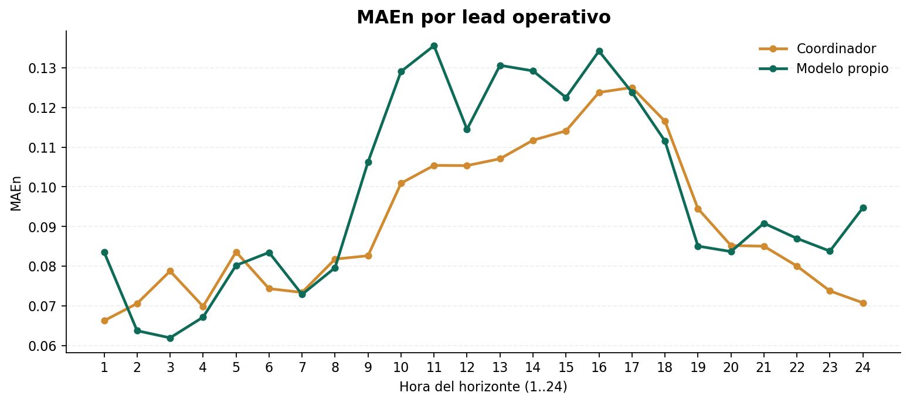
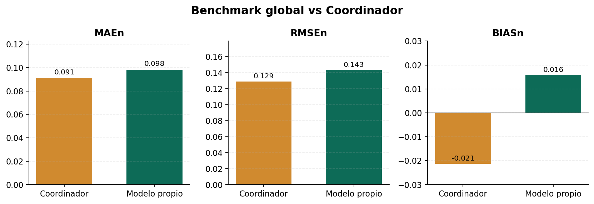
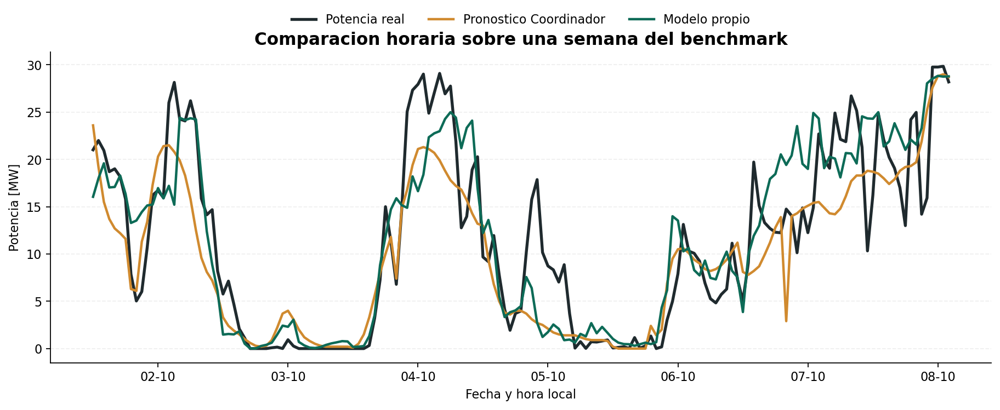
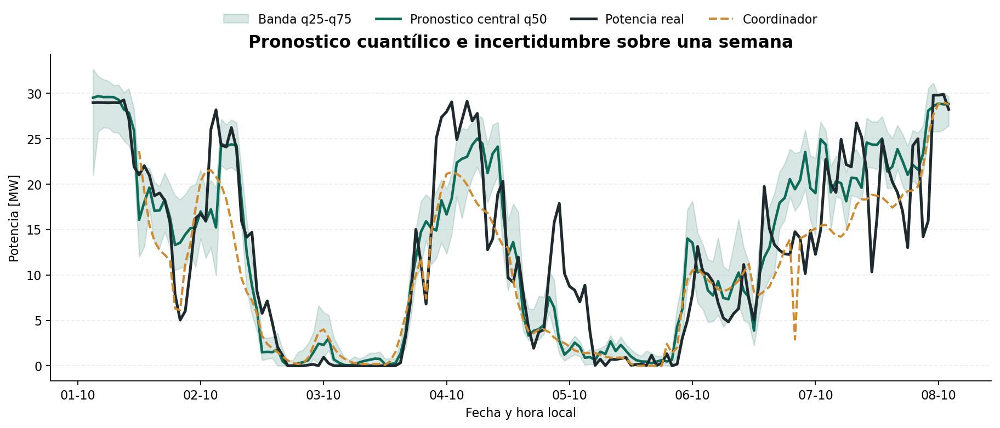
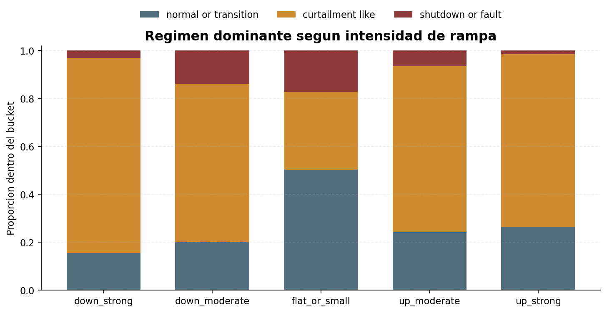
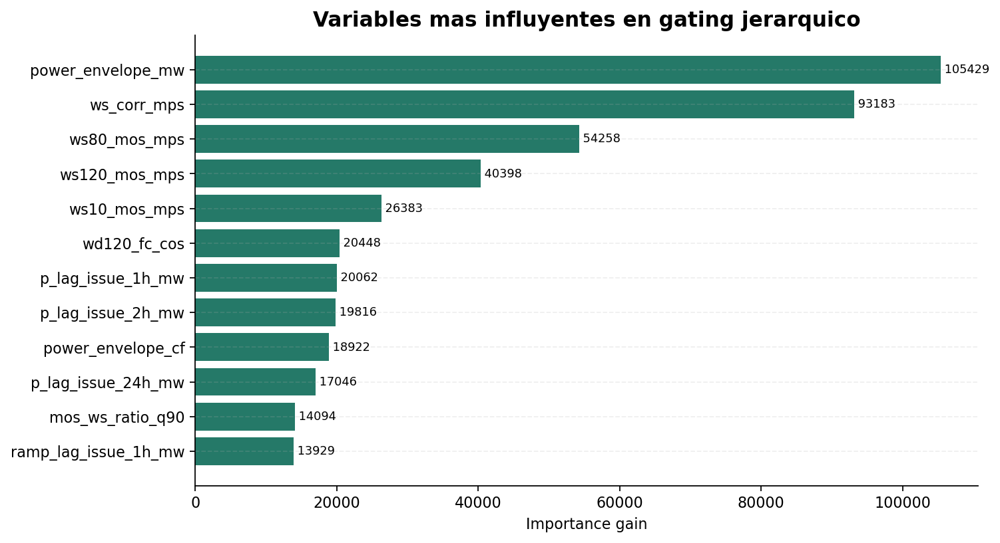

# Sistema de Pronostico Eolico Day-Ahead con Datos Abiertos

## Resumen

Desarrolle un sistema operacional de pronostico eolico para una planta de `36 MW`, usando solo datos de libre acceso para meteorologia y potencia historica medida. El pipeline combina:

- correccion estadistica del viento (`MOS`)
- modelo de potencia por regimenes (`MOE`)
- salidas cuantílicas `q25 / q50 / q75` para representar incertidumbre
- evaluacion con metricas del Coordinador: `MAEn`, `RMSEn`, `BIASn`

El caso operacional se fijo en:

- timezone: `America/Santiago`
- hora de emision: `08:00` local
- horizonte: `24 horas siguientes`
- objetivo: `potencia real inyectada`

## Problema

El objetivo no era solo entrenar un modelo con buen error promedio, sino construir una solucion day-ahead que fuera:

- metodologicamente valida
- comparable con la operacion real
- evaluable contra una referencia externa

La restriccion principal del proyecto fue la observabilidad: no se uso SCADA, disponibilidad de turbinas ni viento a altura de rotor.

## Datos y pipeline

### Inputs

- OpenMeteo forecast
- calendario y contexto temporal local
- potencia historica medida de la planta

### Arquitectura

1. `MOS climatico`
   - corrige sesgo del viento forecast
   - calibra incertidumbre por hora del horizonte

2. `Modelo de potencia por regimenes`
   - modela regimens operativos con mezcla de submodelos
   - solucion base final: `baseline_soft_cqr`

3. `Inferencia diaria`
   - emision a las `08:00` hora Chile
   - salida para las `24 horas` posteriores

## Rigor metodologico

El proyecto se diseno para evitar leakage temporal:

- split por momento de emision, no por la hora futura a pronosticar
- ventana operacional fija `08:00 -> 24h`
- validacion temporal `train / val / test`
- calibracion final ajustada en validacion, no en prueba
- benchmark externo alineado por version diaria emitida

## Resultado interno final

En `test`, la solucion base final `baseline_soft_cqr` obtuvo:

- `MAEn = 9.89%`
- `RMSEn = 14.42%`
- `BIASn = 1.69%`
- `MAE del pronostico central = 3.56 MW`
- `RMSE del pronostico central = 5.19 MW`

Interpretacion:

- buen nivel para un sistema construido con datos abiertos
- resultado util para memoria y portafolio tecnico
- aun por debajo de lo esperable para una solucion industrial con SCADA / hub-height

El comportamiento por hora del horizonte importa mas que una sola metrica agregada. Esta vista se uso para detectar donde el error crecia de forma sistematica y orientar los experimentos posteriores.

## Benchmark externo contra el Coordinador

Se construyo un benchmark leakage-safe contra la programacion diaria historica descargada del Coordinador.

### Regla de comparacion

Para cada dia `D`:

- se usa solo la version diaria publicada por el Coordinador `D_MM.csv`
- se toma la ventana `D 09:00` a `D+1 08:00`
- se compara contra el forecast propio emitido a las `08:00`

Ventana comparable:

- `2025-09-15` a `2025-12-15`
- `90` dias con archivos disponibles
- `2160` horas alineadas

### Resultado del benchmark

Coordinador:

- `MAEn = 9.09%`
- `RMSEn = 12.89%`
- `BIASn = -2.13%`

Modelo propio:

- `MAEn = 9.81%`
- `RMSEn = 14.34%`
- `BIASn = 1.59%`

Lectura:

- el Coordinador gana globalmente en `MAEn` y `RMSEn`
- el modelo propio queda mejor en magnitud de sesgo absoluto
- el modelo propio gana ligeramente en proporcion de horas con menor error absoluto, pero pierde en error agregado diario

Esta comparacion resume la conclusion operacional del proyecto: el benchmark externo fue suficientemente exigente como para mostrar que la solucion era valida metodologicamente, pero todavia no superaba a la referencia externa.

La comparacion horaria sobre una semana operativa ayuda a ver algo que una sola media no muestra: donde cada curva sigue bien la potencia real y donde pierde seguimiento frente a cambios mas bruscos.

Ademas del pronostico central, el sistema entrega una banda cuantílica `q25-q75`. Eso permite representar incertidumbre operacional y no solo un valor puntual.

## Experimentos relevantes

Se evaluaron variantes adicionales para mejorar estabilidad y rampas:

- `curtailment_like + safe_lags`
- `gate-aware switch`
- `gating_hier_safe_lags`
- combinacion de gating jerarquico + safe lags

Hallazgo principal:

- hubo mejoras en `RMSEn`, `BIASn` y estabilidad temporal
- no aparecio una mejora robusta en `MAEn`
- el limite paso a ser mas de observabilidad que de arquitectura

## Estudios que guiaron decisiones

### 1. Rampas y mezcla de regimens

El estudio de rampas mostro que los eventos fuertes se concentraban en horas con comportamiento de recorte. Esa fue la razon para experimentar con ramas especificas y `safe_lags`, en vez de multiplicar submodelos sin justificacion.

### 2. Valor de los safe lags en el gating

La importancia de variables del gating jerarquico mostro que los lags seguros de potencia y rampa si aportaban señal. Eso confirmo que habia margen para mejorar el ruteo del MOE, aunque no fue suficiente para cambiar el candidato final en `MAEn`.

## Aprendizajes

1. En forecasting operacional, la definicion correcta del caso de emision importa tanto como el modelo.
2. Un benchmark justo contra otra referencia requiere alinear snapshots, no solo timestamps.
3. Con datos abiertos se puede construir un sistema serio y reproducible.
4. Sin SCADA, disponibilidad y viento a altura de rotor, el margen de mejora en `NMAE` es limitado.

## Herramientas utilizadas

- Python
- pandas / numpy / xarray
- scikit-learn
- LightGBM
- PowerShell para runners reproducibles
- parquet / JSON para artefactos y contratos

## Artefactos tecnicos relevantes

- `docs/v22/V22_HANDOFF_COMPLETO_2026-03-07.md`
- `config/v22_schema_mos_moe.yaml`
- `config/v22_moe_power_protocol.yaml`
- `reports/v22/moe/final_candidate/final_candidate_summary_v22.json`
- `reports/v22/moe/coord_benchmark_option1/coord_benchmark_option1_summary_v22.json`

